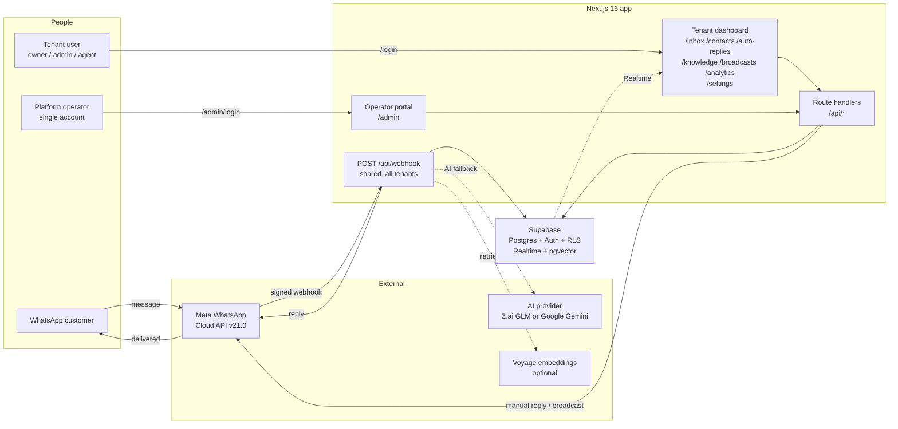
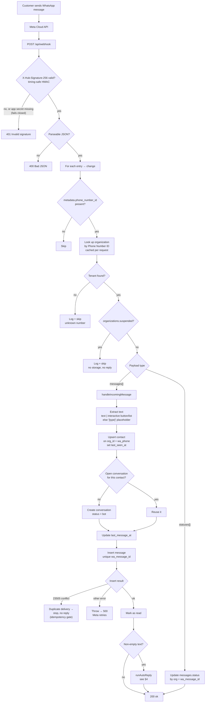
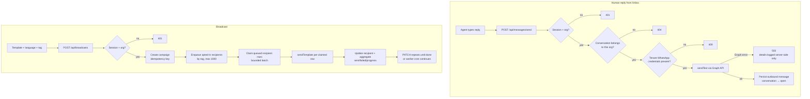
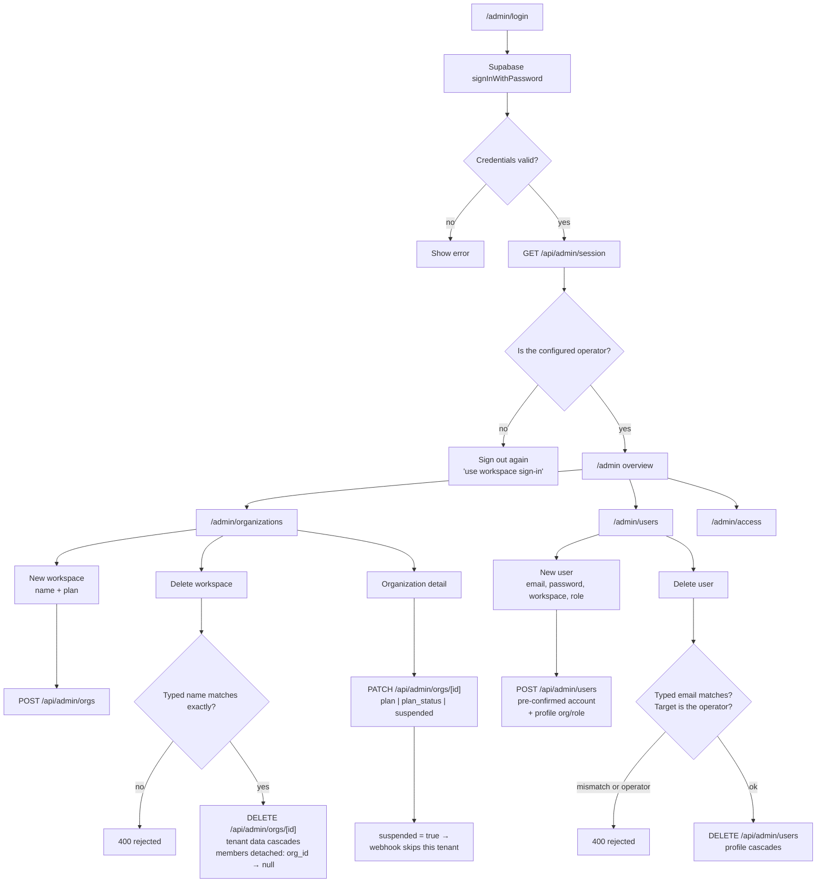
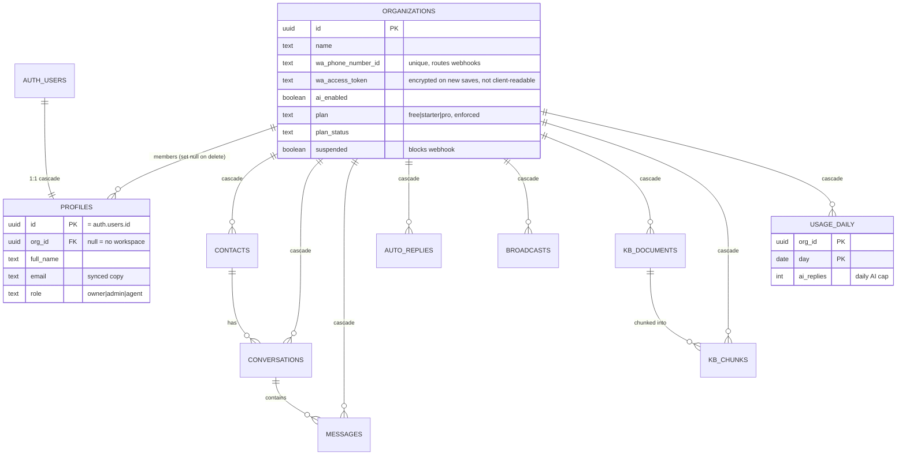

# 15 — Flowcharts

End-to-end flow diagrams for the whole application, as implemented on
2026-07-23. Rendered with Mermaid (GitHub, VS Code, and most Markdown viewers
display these natively).

Related: [02-architecture.md](02-architecture.md),
[05-bot-logic.md](05-bot-logic.md), [04-api-reference.md](04-api-reference.md),
[14-platform-admin.md](14-platform-admin.md).

---

## 1. System overview

---

## 2. Routing and access control

Matched application requests pass through `proxy.ts` first; pages and API routes then re-check
authorization server-side. Navigation is never the only protection.

```mermaid
flowchart TD
  REQ["Incoming request"] --> MW["proxy.ts<br/>refresh Supabase session"]
  MW --> ISOP{"Signed in as the<br/>platform operator?"}

  ISOP -->|"yes, and path is<br/>/inbox /onboarding /login"| TOPLAT["Redirect → /admin"]
  ISOP -->|"no"| AREA{"Which area?"}

  AREA -->|"/admin/*"| PA{"Signed in?"}
  PA -->|"no"| PLOGIN["Redirect → /admin/login"]
  PA -->|"yes"| PGUARD["requirePlatformAdmin&#40;&#41;"]
  PGUARD --> ISSUPER{"email ==<br/>PLATFORM_SUPER_ADMIN_EMAIL?"}
  ISSUPER -->|"no"| TOINBOX["Redirect → /inbox"]
  ISSUPER -->|"yes"| PORTAL["Render operator portal"]

  AREA -->|"dashboard paths"| DA{"Signed in?"}
  DA -->|"no"| TLOGIN["Redirect → /login"]
  DA -->|"yes"| PROF{"profiles.org_id set?"}
  PROF -->|"no"| ONB["Redirect → /onboarding"]
  PROF -->|"yes"| ROLE{"Route needs<br/>owner/admin?"}
  ROLE -->|"yes, and role is agent"| TOINBOX2["Redirect → /inbox"]
  ROLE -->|"otherwise"| DASH["Render dashboard"]

  AREA -->|"/api/admin/*"| APIP{"Operator?"}
  APIP -->|"no"| F403["403 Forbidden"]
  APIP -->|"yes"| APIOK["Execute"]

  AREA -->|"/api/webhook"| SIG["HMAC signature check"]
  AREA -->|"public: /login /admin/login<br/>/reset-password /auth/callback"| PUB["Render"]
```

---

## 3. Inbound message: the core flow

---

## 4. Bot decision tree

```mermaid
flowchart TD
  START["runAutoReply&#40;text, conversation&#41;"] --> HUMAN{"conversation.status<br/>== open?"}
  HUMAN -->|"yes, human owns it"| NONE["No automation"]

  HUMAN -->|"no"| KW{"Active keyword rule matches?<br/>exact | contains | starts_with"}
  KW -->|"yes"| SEND1["Send rule response_text"]
  SEND1 --> ISHELP{"normalized keyword<br/>== 'help'?"}
  ISHELP -->|"yes"| OPEN1["conversation → open<br/>hand off to human"]
  ISHELP -->|"no"| END1["Done"]

  KW -->|"no"| AION{"ZAI_API_KEY set<br/>AND organizations.ai_enabled?"}
  AION -->|"no"| FB["Send static fallback"]

  AION -->|"yes"| QUOTA{"active plan +<br/>bump_ai_usage&#40;&#41;<br/>within plan cap?"}
  QUOTA -->|"no, cap reached"| FB
  QUOTA -->|"DB error"| AIGO["Fail open → continue"]
  QUOTA -->|"yes"| AIGO

  AIGO --> HIST["Load last 20 messages<br/>conversation memory"]
  HIST --> RAG["Retrieve KB context<br/>see §5"]
  RAG --> GLM["Call AI provider (primary, then failover)<br/>system prompt + knowledge_base + history"]

  GLM --> RESULT{"Response"}
  RESULT -->|"error, refusal, or empty"| FB
  RESULT -->|"contains [HANDOFF]"| HO["Strip token<br/>send remaining text<br/>conversation → open"]
  RESULT -->|"normal text"| SEND2["Send AI reply"]
```

---

## 5. Knowledge base: ingestion and retrieval

```mermaid
flowchart TD
  subgraph Ingest["Ingestion — authenticated tenant user"]
    P["PDF upload<br/>POST /api/kb/upload<br/>.pdf, ≤20 MB"] --> EXTRACT["unpdf text extraction"]
    U["Website<br/>POST /api/kb/url"] --> SSRF{"SSRF guard<br/>http/https only<br/>DNS-resolve host<br/>block private/loopback/<br/>link-local/reserved<br/>re-validate ≤3 redirects<br/>cap 5 MB, 20 s"}
    SSRF -->|"blocked"| REJ["422 Blocked host"]
    SSRF -->|"allowed"| CLEAN["cheerio: strip script/style/<br/>nav/footer/header"]
    T["Pasted text<br/>POST /api/kb/text"] --> CHUNK

    EXTRACT --> CHUNK["Chunk text"]
    CLEAN --> CHUNK
    CHUNK --> EMB{"VOYAGE_API_KEY set?"}
    EMB -->|"yes"| VEC["voyage-3.5-lite<br/>vector&#40;1024&#41;"]
    EMB -->|"no"| NOVEC["No embedding"]
    VEC --> STORE
    NOVEC --> STORE["kb_documents + kb_chunks<br/>with org_id"]
  end

  subgraph Retrieve["Retrieval — during an AI reply"]
    Q["Latest customer turn"] --> HASEMB{"Embeddings available?"}
    HASEMB -->|"yes"| MATCH["match_kb_chunks RPC<br/>pgvector cosine, top 5"]
    HASEMB -->|"no"| FTS["Postgres full-text search<br/>fallback"]
    MATCH --> CTX
    FTS --> CTX["Inject into<br/>&lt;knowledge_base&gt; system prompt"]
  end

  STORE -.-> HASEMB
```

---

## 6. Outbound: manual reply and broadcast

---

## 7. Tenant lifecycle

```mermaid
flowchart TD
  S1["Sign up at /login"] --> S2["auth trigger handle_new_user&#40;&#41;<br/>creates profile with email,<br/>org_id = null"]
  S2 --> S3["Redirected to /onboarding"]
  S3 --> S4["create_organization&#40;name&#41;<br/>org + caller as owner<br/>+ seed rules hi/hello/price/help"]
  S4 --> S5["/settings: Phone Number ID<br/>+ access token, AI toggle"]
  S5 --> S6["Operator registers webhook<br/>in the shared Meta app"]
  S6 --> S7["Inbound messages route<br/>to this workspace"]

  ALT["Operator-provisioned path"] --> ALT1["Operator creates workspace<br/>/admin/organizations"]
  ALT1 --> ALT2["Operator creates owner account<br/>/admin/users, role = owner"]
  ALT2 --> ALT3["Hands over temporary password"]
  ALT3 --> S5
```

---

## 8. Platform operator flows

---

## 9. Data model

---

## 10. Security layers

```mermaid
flowchart TD
  subgraph L1["1 — Edge"]
    E1["proxy.ts: session refresh<br/>+ area redirects"]
  end
  subgraph L2["2 — Server guards"]
    G1["Dashboard layout: session + org"]
    G2["requirePlatformAdmin: single operator"]
    G3["Role checks: owner/admin for<br/>credential writes"]
    G4["Webhook: HMAC, fails closed"]
  end
  subgraph L3["3 — Database"]
    D1["RLS: org_id = current_org_id&#40;&#41;"]
    D2["Column privileges:<br/>no client write to org_id/role,<br/>no client read of wa_access_token,<br/>org updates limited to name/ai_enabled"]
    D3["Service role bypasses RLS →<br/>routes must scope by org explicitly"]
  end
  subgraph L4["4 — Cost & abuse"]
    Q1["usage_daily + bump_ai_usage&#40;&#41;"]
    Q2["SSRF guard on URL ingestion"]
    Q3["Atomic webhook dedupe"]
  end

  L1 --> L2 --> L3 --> L4

  OPEN["Still open:<br/>legacy token migration ·<br/>no per-minute rate limits ·<br/>no billing automation ·<br/>broadcast worker/scheduling ·<br/>no audit log"]
  L4 -.-> OPEN
```

